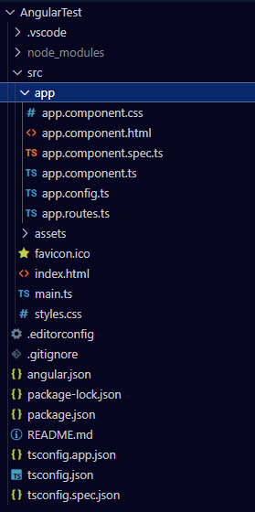

- Voraussetzung zur Arbeit mit Angular muss Node.js installiert sein
	- Als erstes muss Angular Installiert werden dafür muss man Node.js öffnen und  
	  ```Node.JS
	  npm install -g @angular/cli
	  //um zu überprüfen ob alles richtig funktioniert kannst du folgenden befehl durchführen:
	  ng version
	  ```
- Erstellung des Angular Projekts
	- wähle den Ordner in dem du arbeiten willst und führe im Terminal von Visual Studio Code folgenden Befehl aus um ein neues Angular Projekt zu Erstellen
	  ```powershell
	  ng new {Angular-Projekt-Name}
	  ``` 
	  Die Konfiguration des Projektes musst du mit deinen Erfahrungen abstimmen Grundsätzlich kann man aber auch einfach immer Enter drücke und damit die Default werte wählen
	- Die Ordnerstruktur sieht darauf hin wie folgt aus: 
	  
	  Führe im Terminal diesen Befehl aus um die Seite generieren zu lassen füge ein --open hinterher hinzu und die Seite wird automatisch geöffnet
	  ```Powershell
	  ng serve 
	  ```