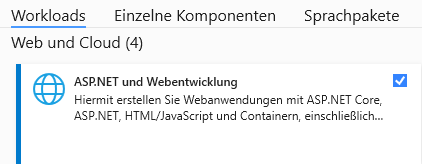
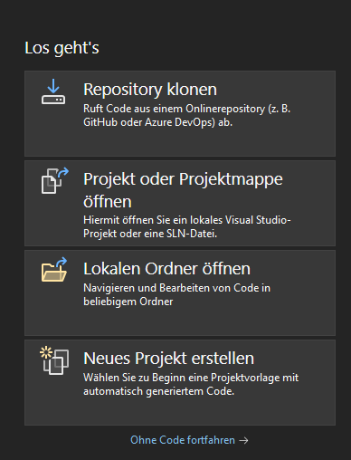
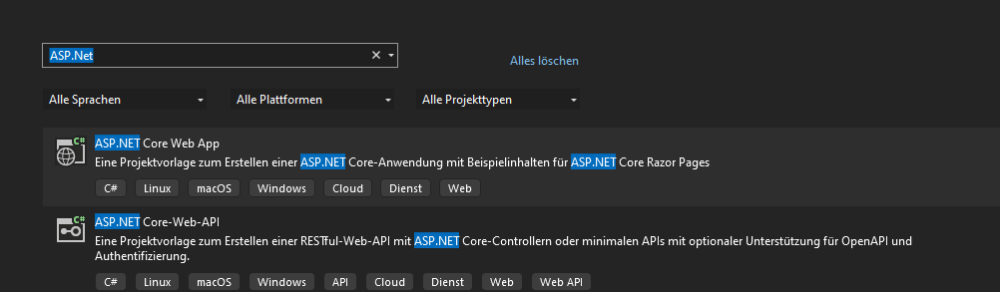
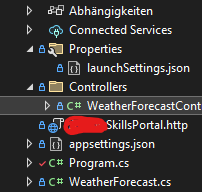

- Zunächst geh sicher dass du in Visual Studio die [[ASP.Net]] Funktionen Aktiviert hast 
- Wenn alles nötige installiert ist erstelle ein Neues Projekt in Visual Studio 
- Suche nach ASP.net und wähle ASP.Net Core-Web-API aus 
- Konfiguriere das Projekt nach deinen Vorstellungen, wenn du Möglichst lange dein backend nutzen willst solltest du vorher die Support länge der Version überprüfen da das Framework noch aktiv aktiviert wird gibt es maximal 2 Jahre Support auf Versionen, das ist abhängig davon wie groß die Änderungen waren und auf andere Faktoren.
- Durch die Erstellung werden mehrere Dateien generiert unter anderem ein Controllers Ordner mit einem Test API Controller in diesem fall WeatherForecastController.cs 
  