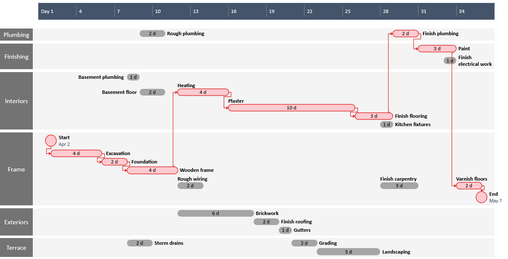

- Definition für Gantt-/Balkendiagramme
	- Ein Ganttdiagramm ist ein Klassisches Projektmanagement-Tool zur Visualisierung aller Aufgaben vom Beginn bis zum Abschluss eines Projekts. Indem die Zeitliche Abfolge von Arbeitsvorgängen in Form von Balken auf einer Zeitachse dargestellt werden. Auch werden die Abhängigkeiten von Arbeitsvorgängen erfasst, man kann auch die verantwortlichen Personen mit aufführen.
- Vorgehen:
	- Im Ganttdiagramm werden die Nummern der Arbeitsschritte in die erste Spalte, die Vorgangsnamen in die Zweite spalte und die Dauer der Arbeitsschritte in die Dritte Spalte einer Tabelle eingetragen. Die Anordnung ist nicht zwangsläufig fix aber im Prinzip immer das gleiche.
	- Nach Erstellung der Tabelle werden die Vorgänge auf einem Kalender als Balken dargestellt, mithilfe von Pfeilen kann man die Nachfolger kenntlich machen.
	- Man kann auch optional den Kritischen-Pfad rot darstellen.
		- Der Kritische Pfad ist der Pfad bestehend aus allen Vorgängen die vom Anfang bis zum ende von einander abhängig sind das heißt auch, wenn ein Vorgang in dem Pfad langsamer ist als gedacht verschiebt sich auch das ende des Projektes.
- Vor und Nachteile
	- |__Vorteile__|__Nachteile__|
	  | Einfach zu erstellen | Teils unübersichtlich bei großen Projekten mit vielen Vorgängen und Abhängigkeiten |
	  | Übersichtlich bei kleinen und Mittelgroßen Projekten | Bei Vorgängen mit großen Zeiträumen wird das Diagramm unübersichtlich |
	  | Schnell zu verstehen | Abhängigkeiten und Puffer sind nicht sofort ersichtlich |
	  |Dauer der Vorgänge deutlich sichtbar |-|
- 
  
  hier ist der Kritische Pfad Rot
-