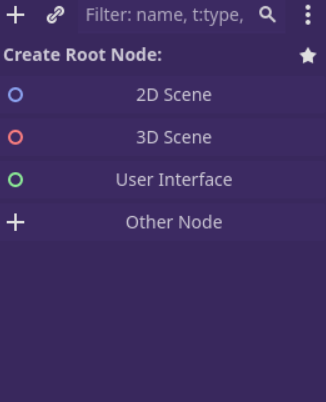
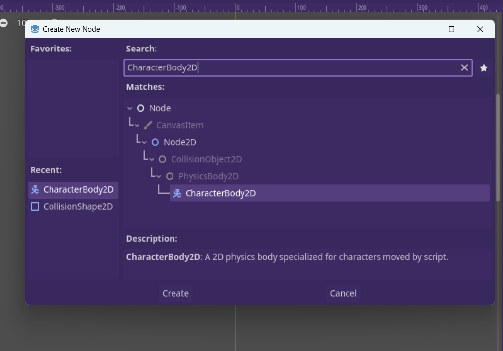
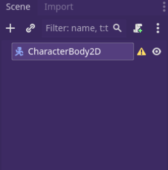
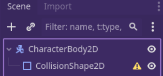
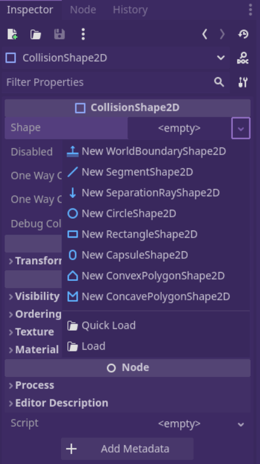

- Beim Hinzufügen des Spielers, geht es darum den Spielbaren Charakter zu erstellen aber noch nicht zu coden. Das heißt wir erstellen das was später dank code der Spielbare Spieler wird und durch den Input des Nutzers dinge tut.
- Step by Step: Hinzufügen des Spielers
	- Als erstes erstellt man eine Scene bzw. man Wählt eine Node aus. Nodes sind Kurz gesagt, die Bausteine von allem in deinem Spiel. Zur Erstellung eines Spielers, in unserem Fall den Spieler eines 2D Spiels, wählen wir Other Node aus oder drücken auf das Plus oben links in der Ecke.
	  
	- Nach dem man other Nodes ausgewählt hat, kommt man in ein Neues Fenster. Dort Suchts du nach "CharakterBody2D", das ist die Basis von spielbaren "Szenen".  Hast du die Node gefunden drückst du auf Create
	  
	- Jetzt können wir in der Linken leiste den CharakterBody2D sehen mit einem Error. Das liegt daran dass ein CharacterBody2D eine Form braucht. 
	  
	- Die Form die Fehlt ist ein Collision-Node, diese gibt die Hitbox an und Dementsprechend gibt sie auch die tatsächliche form des Spielers an. Um es Simpel zu halten beginnen wir mit einem CollisonShape2D:
	  Dafür drücken wir Rechtsklick auf dem CharakterBody2D und dann auf add Child node. Dort dann nach CollisonShape2D suchen und erstellen. So erstellst du für den CharakterBody2D eine CollisionShape2D. Dir müsste aber auch auffallen dass es immer noch ein Error gibt.
	  
	- Um den Fehler zu beheben, musst du den Inspector Öffnen und unter Shape die gewünschte form wählen, Möchtest du eine vollkommen custom shape musst du den ColliosnPolygon2d wählen.
	  
	- Zu guter Letzt ziehst du noch ein Bild auf deinen CharakterBody damit dein spieler auch grafisch zu sehen ist. Danach passt du die Form des Colliders