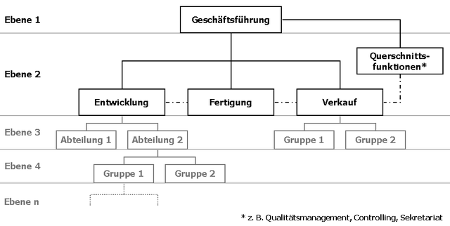

- Das Organigramm ist eine Grafische Darstellung des Aufbaus und der Struktur eines Betriebs. Es ist ein Schaubild, das sichtbar macht welche Einheiten, Abteilungen und Stellen es im Betrieb gibt und wie die Beziehungen zwischen den Einheiten sind. Mit dem Organigramm soll einfach und anschaulich dargestellt werden, wie Aufgaben verteilt sind, wie Informationen fließen, wer an wen Anordnungen geben kann und Leitungsbefugnisse hat.
	- Um ein Organigramm aufzeichnen zu können sollte man auch die unter arten der stellen kennen und wissen wer Weisungsbefugt ist und wer nicht:
		- Unternehmensleitung:
			- Weisungsbefugnis gegenüber allen stellen
		- Instanzen:
			- Stellen mit Leitungsbefugnis. d.h. Sie dürfen eigenständig Entscheidungen treffen und Stellen Weisungen erteilen
		- Stabstellen:
			- Sie haben weder Entscheidungs- noch Weisungsbefugnisse. Sie erfüllen lediglich eine Unterstützungs-/Berater Funktion für Instanzen und Unternehmensleitungen.
		- Ausführende Stellen:
			- Sie führen die Anordnungen der Instanzen aus und besitzen selbst keine Entscheidungs- noch Weisungsbefugnisse
- 