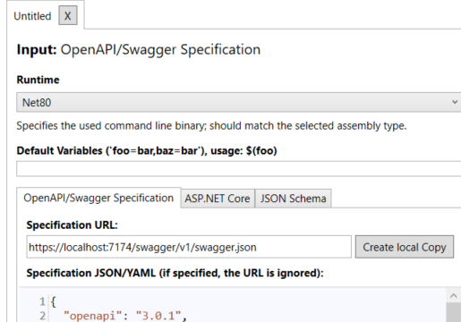

- Einrichtung von NSwag auf dem Backend:
	- Öffne die Package Manager Console in Visual Studio und führe diesen Befehl aus:
	  ```Powersehll
	  Install-Package NSwag.AspNetCore
	  ```
	- Nun muss man das Backend an NSwag anpassen dafür muss man die Program.cs datei anpassen:
		- ```C#
		  var builder = WebApplication.CreateBuilder(args);
		  // Add services to the container.
		  builder.Services.AddControllers();
		  // Learn more about configuring Swagger/OpenAPI at https://aka.ms/aspnetcore/swashbuckle
		  builder.Services.AddEndpointsApiExplorer();
		  builder.Services.AddSwaggerGen();
		  builder.Services.AddOpenApiDocument();
		  var app = builder.Build();
		  // Configure the HTTP request pipeline.
		  if (app.Environment.IsDevelopment())
		  {
		      app.UseSwagger();
		      app.UseOpenApi();
		      app.UseSwaggerUi();
		  }
		  app.UseHttpsRedirection();
		  app.UseAuthorization();
		  app.MapControllers();
		  app.Run();
		  ```
		  Hier wurde builder.Service.AddOpenApiDocument(); app.UseSwaggerUi() und app.UseOpenApi()  Hinzugefügt, diese sind für die Nutzung von NSwag notwendig.
		- Um die Verbindung zum Frontend herzustellen, muss man ein Tool installieren namens: [NSwagStudio](https://github.com/RicoSuter/NSwag/wiki/NSwagStudio) dieses Tool kann Code für deinen Client generieren je nachdem wie dein Frontend funktioniert brauchst du verschiedene arten, um mit Angular zu arbeiten, musst du TypeScript Client auswählen.
		  Um das Tool zu nutzen, musst du auf der Linken Seite den Input einsetzten, Starte dafür dein Backend und füge hinter der Localhost URL ein /swagger/v1/swagger.json hinzu und klicke auf Create Local Copy um das Backend als JSON Datei darzustellen, geh sicher, dass die Runtime auf der aktuellsten Version bzw. deiner Version eingestellt ist.
		  
		- Nun Zum Output:
			- Wähle TypeScript Client, wähle in den Einstellungen eine geeignete TypeScriptversion oder die nächste an deiner Version. Nutze als Template Angular als Injection token type wähle InjectionToken. Scrolle zu guter Letzt nach ganz unten zum Output File path und wähle als Ort am besten direkt den Workspace bzw. lege den Output, sodass die Datei im src Ordner deiner Angular Frontend Anwendung herauskommt und Generiere die Datei mittels Generate Files. Um sicherzugehen, dass alles einwandfrei funktioniert, kannst du den Output vorher generieren und gucken, ob alles funktioniert.
		- Nachdem du den Output generiert hast und die Datei erstellt wurde sollte eigentlich alles fertig sein, so hast du schon backend und Frontend
- [[Verbindungstest NSwag Backend mit Angular Frontend]]
-
-
-
-
-
-
-
-
- Quelle der Methode: [Get started with NSwag and ASP.NET Core](https://learn.microsoft.com/en-us/aspnet/core/tutorials/getting-started-with-nswag?view=aspnetcore-8.0&tabs=visual-studio)